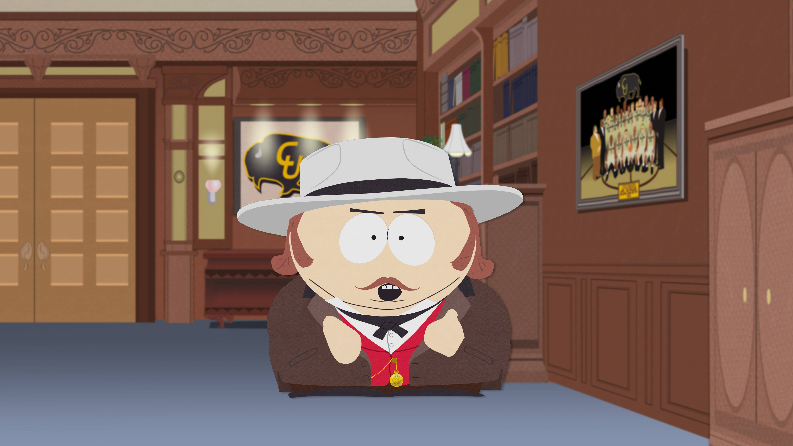
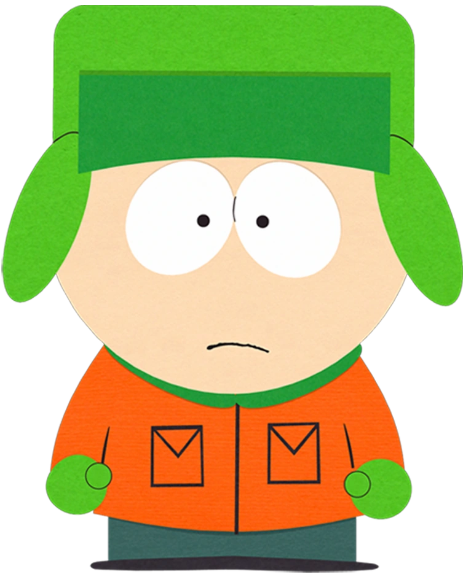

<!DOCTYPE html>
<html lang="en">
<head>
    <meta charset="UTF-8">
    <meta name="viewport" content="width=device-width, initial-scale=1.0">
    <link rel="stylesheet" href="style.css">
    <link rel="preconnect" href="https://fonts.googleapis.com">
    <link rel="preconnect" href="https://fonts.gstatic.com" crossorigin>
    <link href="https://fonts.googleapis.com/css2?family=Montserrat:ital,wght@0,100..900;1,100..900&display=swap" rel="stylesheet">
    <title>South Park</title>
</head>
<body>
    <header>
        

            

            

                
            

            

                

                    
                

                

                    
                

            

        

        

            <nav>
                <ul>
                    <li>Эпизоды</li>
                    <li>События</li>
                    <li>Вики</li>
                    <li>Новости</li>
                    <li>Аватар</li>
                    <li>магазин</li>
                    <li>Форум</li>
                    <li>Игры</li>
                </ul>
            </nav>
        

    </header>
    <main>
        <section class="banner">
            <button>Новые серии</button>
        </section>
        <section class="episodes">
            <h1>Полные серии</h1>
            

                

                    
                

                

                    

                        <h2>S16 • E8</h2>
                        <h4>South Park</h4>
                        <h3>Саркастабалл</h3>
                        
Начальная школа Южного парка предпринимает шаги для решения проблемы сотрясения мозга в футболе.

                    

                    <h5>09/26/2012</h5>
                

            

            

                
                

                    <h2>S15 • E5</h2>
                    <h4>South Park</h4>
                    <h3>Спортивная ассоциация Crack Baby</h3>
                    
Кайл попадает на первый этаж последнего предприятия Картмана — Спортивной ассоциации Crack Baby.

                    <h5>18/05/2011</h5>
                

            

            

                
                

                    <h2>S8 • E2</h2>
                    <h4>South Park</h4>
                    <h3>Вверх вниз стероид</h3>
                    
Джимми готовится к предстоящим Специальным Олимпийским играм и полон решимости победить любой ценой.

                    <h5>24/03/2004</h5>
                

            

            

                
                

                    <h2>S10 • E14</h2>
                    <h4>South Park</h4>
                    <h3>Кубок Стэнли</h3>
                    
Стэн Марш достиг дна. У него нет ни работы, ни велосипеда, и его единственный выход из плохой ситуации — тренировать местную хоккейную команду.

                    <h5>11/15/2006</h5>
                

            

        </section>
        <section class="quotes">
            <h1>«К черту вас, ребята, я иду домой» — Стэн</h1>
            
Цитаты персонажей

            

                

                    
                

                

                    

                        <h2>S7 • E14</h2>
                        <h4>South Park</h4>
                        <h3>Красивая печаль</h3>
                        
Стэн и Баттерс решают преодолеть свою боль и наслаждаться жизнью.

                    

                    <h5>12/10/2003</h5>
                

            

        </section>
        <!-- <section class="heroes">
            

                
                
                <h3>Стэн</h3>
            

            

                
                
                <h3>Кайл</h3>
            

            

                
                
                <h3>Картман</h3>
            

            

                
                
                <h3>Кенни</h3>
            

        </section> -->
        <section class="news">
            <h1>Последние новости</h1>
            

                
                <h3>Сборник: И вот мы снова</h3>
                <h5>19/02/2025</h5>
            

            

                
                <h3>Коллекция: Love Gravy</h3>
                <h5>12/02/2025</h5>
            

            

                
                <h3>Коллекция: Большая игра</h3>
                <h5>05/02/2025</h5>
            

            

                
                <h3>Сборник: Премьеры сезона</h3>
                <h5>29/01/2025</h5>
            

            

                
                <h3>Коллекция: Шенаниганы</h3>
                <h5>22/01/2025</h5>
            

            

                
                <h3>Сборник: Слава шефу</h3>
                <h5>15/01/2025</h5>
            

            

                
                <h3>Коллекция: Приветствую</h3>
                <h5>08/01/2025</h5>
            

            

                
                <h3>Коллекция: Резолюции</h3>
                <h5>01/01/2025</h5>
            

            

                
                <h3>Сборник: С Рождеством!</h3>
                <h5>25/12/2024</h5>
            

            

                
                <h3>Коллекция: Зимние каникулы</h3>
                <h5>18/12/2024</h5>
            

            

                
                <h3>Сборник: Лучшее из Шэрон</h3>
                <h5>12/11/2024</h5>
            

            

                <button>Показать еще</button>
            

        </section>
        <section class="about">
            

                <h2>South Park</h2>
                
Наслаждайтесь без цензуры, полными эпизодами South Park, новаторским мультсериалом Peabody и Emmy®. Следите за всеми любимыми смутьянами — Стэном, Кайлом, Картманом и Кенни — с самого начала их незабываемых приключений.

            

        </section>
        <section class="games">
            <h1>Консольные и мобильные приложения</h1>
            

                
                <h3>Снежный день</h3>
                <h5>Консольные</h5>
                <h4>Узнать больше</h4>
            

            

                
                <h3>Палка Истины</h3>
                <h5>Консоль</h5>
                <h4>Узнать больше</h4>
            

            

                
                <h3>Сломанный, но целый</h3>
                <h5>Консоль</h5>
                <h4>Узнать больше</h4>
            

            

                
                <h3>Уничтожитель телефонов</h3>
                <h5>Мобильное приложение </h5>
                <h4>Узнать больше</h4>
            

        </section>
        <section class="characters">
            <h2>Перонажи</h2>
            

                
                <h3>Эрик Теодор Картман</h3>
                <h4>10</h4>
                
Эрик Теодор Картман, которого обычно называют просто Картман, — один из главных героев, наряду со Стэном Маршем, Кайлом Брофловски и Кенни МакКормиком. 

            

            

                
                <h3>Кеннет «Кенни» МакКормик</h3>
                <h4>9</h4>
                
Кеннет «Кенни» МакКормик, озвученный Мэттом Стоуном, — один из главных персонажей «Южного Парка», наряду с Эриком Картманом, Стэном Маршем и Кайлом Брофловски. 

            

            

                
                <h3>Стэнли «Стэн» Марш</h3>
                <h4>10</h4>
                
Стэнли «Стэн» Марш — один из главных героев «Южного Парка», наряду с Кайл Брофловски, Эрик Картман и Кенни МакКормик. 

            

            

                
                <h3>Кайл Брофловски</h3>
                <h4>10</h4>
                
Кайл Брофловски — один из главных героев «Южного Парка», наряду со Стэном Маршем, Эриком Картманом и Кенни МакКормиком. 

            

            

                
                <h3>Леопольд «Баттерс» Стотч</h3>
                <h4>10</h4>
                
Леопольд Баттерс Стотч — главный герой сериала. Он учится в четвёртом классе начальной школы Южного Парка. 

            

            

                
                <h3>Джимми Валмер</h3>
                <h4>10</h4>
                
Джимми Валмер (ранее Джимми Свонсон)  — четвероклассник, инвалид, стендап-комик, страдает заиканием и ДЦП, а потому передвигается на костылях, волоча ноги.

            

            

                
                <h3>Тимоти "Тимми" Берч</h3>
                <h4>10</h4>
                
Тимоти «Тимми» Берч — ученик четвертого класса начальной школы Южного Парка. Впервые он появляется в эпизоде ​​​​четвертого сезона «Зуб за зуб зубной феи», его озвучивает Трей Паркер.

            

            

                
                <h3>Твик Твик</h3>
                <h4>10</h4>
                
Твик Твик — ученик четвёртого класса начальной школы Южного Парка. Он пьёт много кофе, в который подмешивают мет, вызывающий паранойю и мышечные спазмы.

            

            

                
                <h3>Крейг Такер</h3>
                <h4>10</h4>
                
Крейг Такер — ученик четвёртого класса мальчиков. Самой отличительной чертой Крейга является его синяя шапка-чульо, увенчанная жёлтым помпоном.

            

            

                
                <h3>Карен МакКормик</h3>
                <h4>6</h4>
                
Карен МакКормик, дочь Стюарта и Кэрол МакКормик, сестра Кенни и Кевина МакКормик.

            

            

                
                <h3>Кевин МакКормик</h3>
                <h4>13</h4>
                
Кевин МакКормик, персонаж мультсериала Южный Парк, сын Стюарта и Кэрол МакКормик, брат Кенни и Карен МакКормик. 

            

            

                
                <h3>Пит Тельман</h3>
                <h4>10</h4>
                
Пит впервые появился в «Изюминке», когда Стэн пытается присоединиться к их группе после того, как Венди бросила его. 

            

            

                
                <h3>Венди Тестабургер</h3>
                <h4>7</h4>
                
Венди Тестабургер — основной персонаж «Южного Парка».

            

            

                
                <h3>Айк Брофловски</h3>
                <h4>3</h4>
                
Сэр Айк Мойша Брофло́вски, родившийся под именем Питер Гинц, — приёмный младший брат Кайла Брофловски из Канады.

            

            

                
                <h3>Клайд Донован</h3>
                <h4>10</h4>
                
Клайд Донован, иногда Клайд Гудман и Клайд Харрис, — один из одноклассников мальчиков.

            

            

                
                <h3>Джером МакЭлрой</h3>
                <h4>40</h4>
                
Джером МакЭлрой, которого обычно называют Шефом, был постоянным персонажем «Южного Парка».

            

            

                
                <h3>Токин Блэк</h3>
                <h4>10</h4>
                
Толкин Блэк, ранее известный как Токен Блэк и Токен Уильямс, — ученик четвёртого класса начальной школы Южного Парка,

            

            

                
                <h3>Кайл Шварц</h3>
                <h4>10</h4>
                
Кайл Шварц - персонаж мультсериала Южный парк, двоюродный брат Кайла Броффловски. 

            

            

                
                <h3>Энни Ниттс</h3>
                <h4>10</h4>
                
Энни Ниттс, ранее Энни Нельсон и Энни Фолк, учится в начальной школе Южного Парка.

            

            

                
                <h3>Скотт Малкинсон</h3>
                <h4>10</h4>
                
Скотт Малкинсон (Scott Malkinson) - персонаж, впервые появляющийся в серии Мюзикл начальной школы. 

            

            

                
                <h3>Бебе Стивенс</h3>
                <h4>10</h4>
                
Бебе Стивенс — ученица четвёртого класса начальной школы Южного Парка

            

            

                
                <h3>Нейтан</h3>
                <h4>10</h4>
                
Нейтан - умственно отсталый ученик начальной школы Южного парка, которого впервые можно увидеть в эпизоде ​​​​восьмого сезона «Другая сторона стероидов».

            

            

                
                <h3>Хайди Тёрнер</h3>
                <h4>7</h4>
                
Хайди Тёрнер - ученица четвертого класса, а так же бывшая девушка Эрика

            

            

                
                <h3>Филип Пиррип</h3>
                <h4>10</h4>
                
Филип «Пип» Пиррип,над которым часто издевались, был неуклюжим осиротевшим учеником по обмену из Англии.

            

            

                
                <h3>Гэри Харрисон</h3>
                <h4>10</h4>
                
Гэри Харрисон — первый персонаж-мормон в Южном Парке. Впервые он появляется в эпизоде "Всё о мормонах ". 

            

            

                
                <h3>Крот</h3>
                <h4>10</h4>
                
Кристоф - является горьким французским девятилетним ребенком с опытом секретных операций и сильной ненавистью к Богу.

            

            

                
                <h3>Триша</h3>
                <h4>5</h4>
                
Триша Такер - второстепенный персонаж мультсериала Южный Парк. 

            

            
        </section>
    </main>
    <footer>
        
Мурашкин Никита, 2025

    </footer>
</body>
</html>
